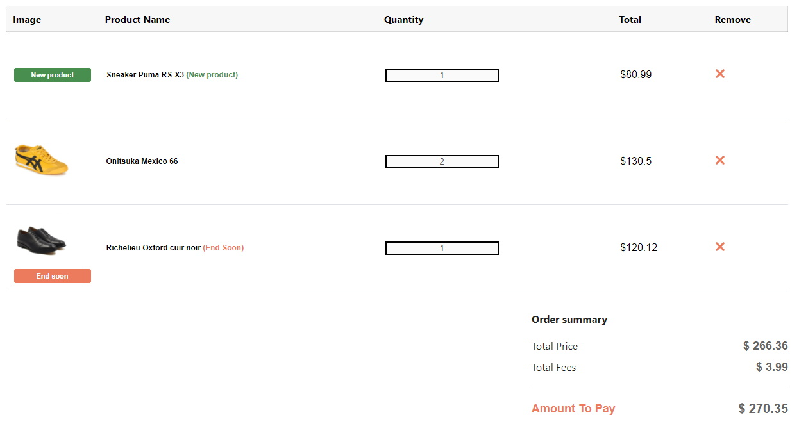
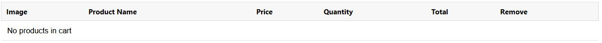
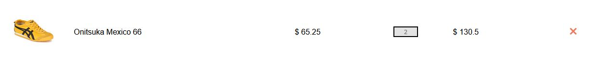

# React Refactoring Kata

## 🚩 Context

I want to refactor and clean the code of the company website cart page.


## ⚙️ Business Rules Implemented

The cart page is composed of a products list and a summary.
Heres the list of the business logics implemented:

### 🛒 Cart Page

```
- If user is connected then display cart page
- If user is NOT connected then do NOT display cart page
```

### 🧾 Products list

The products list display the cart products list of the user.

##### Component Display

```
- If product list is empty then display a row with message "No products in cart"
```



##### User Actions

```
- User can delete product of the products list
```

##### Product Row

There are 3 different type of products (In our page the products list contains the 3 differents type).

Each row contains :

- A picture
- The product name
- The price for one product
- the quantity
- the total price

```
An common product is displayed without specific rules
```



```
An new product is displayed with a label 'New product' instead of the picture and next to the product title
```


```
An ended product is displayed with a label 'End soon' next to the picture and the product title
```


##### Product Discount

```
- If product have discount then display old price striped and the new price next to it
```

### 💲 Summary

The summary display the total price of the cart with the details of discounts and of other advantages.

##### Component Display

```
- If product list is empty then do NOT display discounts details and button 'buy'
- If product list is NOT empty then display discounts details and button 'buy'
```

##### Total Price Calculation

```
- If user have no product(s) then total price is equal to $0
```

Heres the step to calculate the total price:

```
1. Calculate the total price with quantities
2. Apply "coupon" discount percentage
    - If user have coupon then apply coupon percentage
    - If user have NOT coupon then do notihng
3. Apply delivery fees
    - If user is VIP delivery fees is free
    - If user is NOT VIP add delivery fees ($3.99)
```

## ✔️ Acceptance Criteria

- Clean the code
- do NOT break any business rules.

## 👍 Useful commands

> `npm start`: Launch the page
>
> `npm test`: Launch the tests
